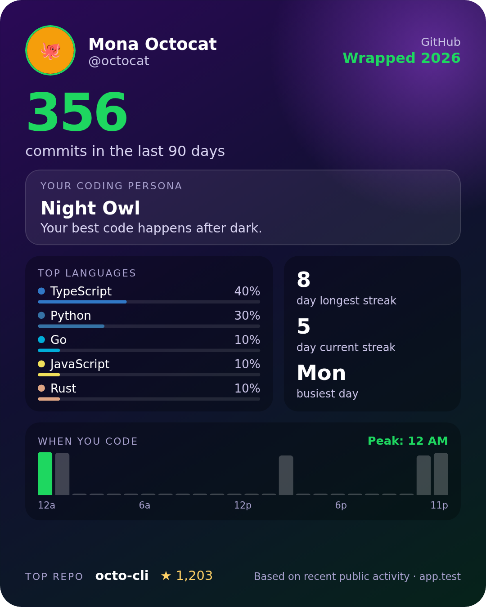

# GitHub Wrapped

A Spotify Wrapped-style card for any GitHub user: top languages, busiest coding hours, streaks and a coding persona, on one card you can download and share.



## Features

- **Story mode**: full-screen animated slides like Spotify Wrapped (count-up numbers, growing charts, persona reveal). Tap or use ←/→ to navigate, Esc to skip
- **Animated card**: staggered entrance, shine sweep and a 3D tilt on hover. Downloads stay static and clean
- **Top languages** across your own (non-fork) repos
- **When you code**: a 24-hour activity chart and your peak hour, in your local timezone
- **Streaks**: longest and current run of active days
- **Coding persona**: Night Owl, Early Bird, Weekend Warrior, 9-to-5 Pro or Code Nomad
- **Top repo** by stars
- **Download as PNG** at 1080×1350, LinkedIn's recommended portrait size
- **Shareable links**: `?user=<login>` loads a card directly

Animations respect your system's "reduce motion" setting: with it on, the story is skipped and the card appears without motion.

## How it works

It's a static site with no build step and no backend. The browser calls the public GitHub API directly:

| Data | Endpoint |
| --- | --- |
| Profile | `GET /users/{user}` |
| Languages, top repo | `GET /users/{user}/repos` |
| Hours, weekdays, recent streaks | `GET /users/{user}/events/public` (last ~90 days, up to 300 events) |
| Full-year contributions and streaks (optional) | GraphQL `contributionsCollection`, needs a token |

Without a token, the app uses about 5 of GitHub's 60 unauthenticated requests per hour. If you paste a [fine-grained token](https://github.com/settings/tokens?type=beta) with no extra permissions, it also fetches the full-year contribution calendar. The token is only sent to `api.github.com` and is never stored.

```
index.html        page shell
style.css         site and card styles
src/app.js        UI, card rendering, PNG export, sharing
src/story.js      full-screen story slides
src/ui.js         shared helpers (colors, count-up animation)
src/background.js twinkling contribution-grid background
src/github.js     GitHub REST + GraphQL client
src/stats.js      pure stat functions (languages, streaks, persona, ...)
test/             unit tests for stats.js
```

## Run locally

ES modules need an HTTP server rather than `file://`:

```sh
npm start        # serves the folder with `npx serve`
npm test         # runs the unit tests (Node 18+)
```

## Deploy to GitHub Pages

1. Push this repo to GitHub.
2. Go to **Settings → Pages**, set **Source** to *Deploy from a branch*, and pick your branch with the `/ (root)` folder.
3. Your app will be live at `https://<you>.github.io/<repo>/`.

## Ideas for v2

- Compare two users side by side
- Year-over-year comparison
- Server-rendered Open Graph image so shared links show a preview of the card

---

Not affiliated with GitHub or Spotify.
